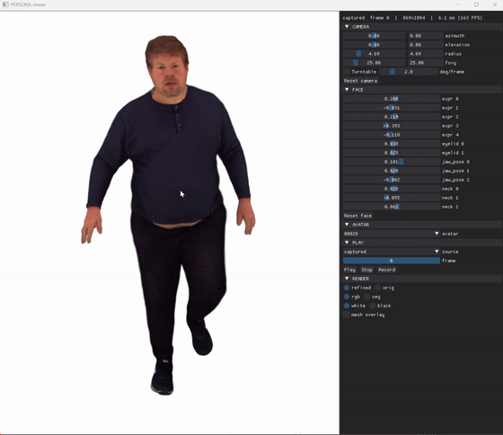
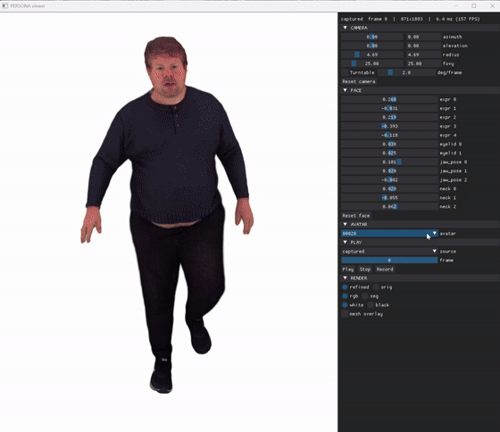

# SRE-Avatar: Expressive 3D Gaussian Avatars across Viewing Scales

[]()
[]()

## Install
```
conda create -n sreavatar python=3.10 -y
conda activate sreavatar                                                     
pip install -r requirements.txt
```

### SMFLIX and avatars
- Download the SMFLIX model from [SMFLIX](https://github.com/XRLab-KU/SMFLIX) ([zip](https://drive.google.com/file/d/1DJ34hzrtLy04ABHo4dYFir8gYYAIvXpN/view?usp=sharing), password-protected: pw:) and unzip it into `common/utils/human_model_files/`.
- Download the trained [avatars](https://drive.google.com/file/d/1VwkLUbPD6J_gllrm0Q47uESqLMozQgfK/view?usp=drive_link) and unzip them so that each one is at `avatars/<subject_id>/snapshot_<epoch>.pth`.

```
SREAvatar/
├── avatars/
│   ├── 00028/snapshot_4.pth
│   ├── V00_S0394_I00000487_P0526/snapshot_4.pth
│   └── jogging/snapshot_4.pth
└── common/utils/human_model_files/
    └── SMFLIX/
        ├── SMFLIX_NEUTRAL.npz
        ├── smflix_texture.png
        └── smflix_uv.npz
```

## Viewer
Run from `main/`:
```
conda activate sreavatar                                                     
cd main
python viewer.py
```

### Mouse (on the image)
- Left drag: orbit
- Right drag: pan
- Wheel: zoom

### Avatar and motion
Switch avatars in AVATAR and choose a motion (`captured`, `face_demo`, `walking`) in PLAY, then press Play.

<p>
  
  
</p>


